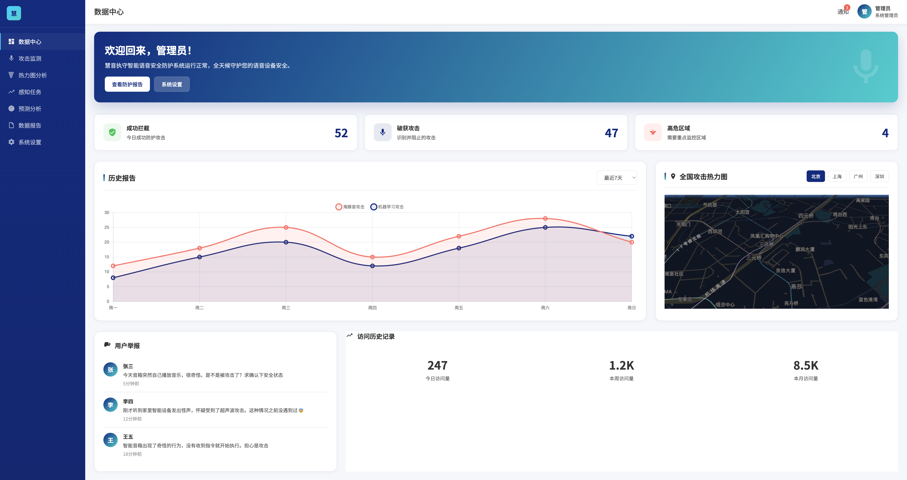

# 慧音执守 - 物联网语音安全领航者



## 📋 项目简介

慧音执守是一款专注于物联网语音安全的创新防护系统，由武汉大学计算机学院团队开发。系统构建了多维度语音安全保障体系，以智能语音识别过滤为核心，结合群智感知、态势识别技术支持，有效解决智能语音攻击难识别、非预知、高隐蔽的技术痛点。

## 🎯 核心功能

### 🔍 智能语音识别
- 基于SVM的音频分类过滤机制
- 超声波攻击、海豚音攻击等恶意语音识别
- 检测精度达98%以上，毫秒级响应

### 🧠 AI情感分析
- 基于LSTM的语音文本情感检测
- 深度分析语音情感特征
- 识别异常语音行为和恶意指令

### 📊 态势感知预警
- 基于态势感知的安全预警算法
- 实时分析攻击趋势，预测潜在威胁
- CNN-GRU热力图态势预测

### 🌐 群智感知网络
- 基于激励算法的群智感知机制
- 调动用户参与威胁检测
- 构建分布式智能防护网络

## 🏗️ 系统架构

### 前端页面结构
```
├── index.html              # 系统主页
├── login.html              # 用户登录
├── dashboard.html          # 数据中心仪表盘
├── attack_monitor.html     # 攻击监测中心
├── heatmap_analysis.html   # 热力图分析
├── sensing_tasks.html      # 感知任务管理
├── prediction_analysis.html # 预测分析
├── data_reports.html       # 数据报告
├── student_dashboard.html  # 学生仪表盘
└── system_settings.html    # 系统设置
```

### 核心技术栈
- **前端技术**: HTML5 + CSS3 + JavaScript ES6+
- **数据可视化**: Chart.js + L7地图引擎 + 高德地图API
- **AI算法**: SVM分类、LSTM情感检测、CNN-GRU预测
- **设计风格**: Material Design + 响应式布局

## 🚀 应用场景

### 🏠 智能家居防护
- 智能音箱实时防护，阻断恶意指令
- 多设备联动防护，构建安全网络
- 攻击事件实时报告，及时响应处理

### 🏢 企业安全管理
- 会议系统安全防护，防止窃听攻击
- 多终端统一管理，提升防护效率
- 商业机密保护，确保信息安全

### 📱 个人设备防护
- 移动设备实时保护，防止恶意唤醒
- 个性化安全配置，满足不同需求
- 隐私数据加密，保护个人信息

### 🛡️ 安全监管中心
- 全网攻击态势监控，及时发现威胁
- 安全策略统一管理，确保防护有效
- 应急响应机制，快速处置安全事件

## 💻 技术特色

### 🤖 AI智能分析
- **检测精度**: 98%+
- **响应时间**: 毫秒级
- **分析能力**: 多模态

### 🔬 核心算法
1. **SVM音频分类**: 精准识别恶意语音攻击
2. **LSTM情感检测**: 深度分析语音情感特征
3. **群智感知网络**: 构建分布式防护体系
4. **CNN-GRU预测**: 智能预测攻击趋势

## 📦 安装部署

### 环境要求
- Node.js 14.0+
- 现代浏览器 (Chrome 70+, Firefox 70+, Safari 12+)
- 网络连接 (用于地图API调用)

### 快速开始
```bash
# 1. 克隆项目
git clone https://github.com/your-repo/huiyin-zhishou.git
cd huiyin-zhishou

# 2. 安装依赖
npm install

# 3. 启动开发服务器
npm start

# 4. 访问系统
# 打开浏览器访问 http://localhost:3000
```

### 生产部署
```bash
# 构建生产版本
npm run build

# 部署到服务器
npm run deploy
```

## 🎨 界面预览

### 📊 数据中心
- 实时攻击态势监控
- 3D热力图可视化
- 关键指标统计面板

### 🚨 攻击监测
- 实时事件流展示
- 攻击详情分析
- 快速响应操作

### 📈 预测分析
- AI驱动的趋势预测
- 风险评估报告
- 防护策略推荐

## 🛠️ 开发指南

### 项目配置
```javascript
// package.json 主要配置
{
  "name": "huiyin-zhishou",
  "version": "1.0.0",
  "description": "物联网语音安全防护系统",
  "main": "index.html",
  "scripts": {
    "start": "live-server --port=3000",
    "build": "webpack --mode=production",
    "dev": "webpack serve --mode=development"
  }
}
```

### 目录结构说明
```
GuardianV2/
├── public/                 # 静态资源
│   ├── dashboard.png      # 系统展示图
│   ├── jiaju.png         # 智能家居图
│   ├── bigcompany.jpg    # 企业管理图
│   └── ...               # 其他图片资源
├── node_modules/          # 依赖包
├── package.json          # 项目配置
├── package-lock.json     # 依赖锁定
└── *.html               # 页面文件
```

## 📊 性能指标

| 指标 | 数值 | 说明 |
|------|------|------|
| 检测精度 | 98%+ | 语音攻击识别准确率 |
| 响应时间 | <100ms | 攻击检测响应延迟 |
| 并发处理 | 1000+ | 同时处理的音频流数 |
| 误报率 | <2% | 正常语音被误判为攻击 |

## 🏆 获奖情况

- 🥇 **自强杯** - 计算机设计大赛优秀作品
- 🎖️ **创新奖** - 物联网安全领域技术创新
- 🏅 **最佳应用奖** - 实用性和创新性兼备

## 👥 团队介绍

**武汉大学计算机学院研发团队**
- 专业领域：人工智能、语音识别、网络安全
- 研究方向：物联网安全、语音信号处理、机器学习
- 使命：构建更安全的物联网生态环境

## 📞 联系我们

- **📧 邮箱**: contact@huiyinzhishou.com
- **📱 电话**: 010-12345678
- **🏢 地址**: 北京市海淀区计算机设计大赛专用
- **🌐 官网**: [慧音执守官方网站](https://huiyinzhishou.com)

## 📄 开源协议

本项目采用 [MIT License](LICENSE) 开源协议。

## 🙏 致谢

感谢所有为慧音执守项目贡献的开发者和研究人员，以及武汉大学计算机学院的技术支持。

---

**慧音执守** - 让物联网语音更安全 🛡️

*© 2025 慧音执守团队. 保留所有权利.* 